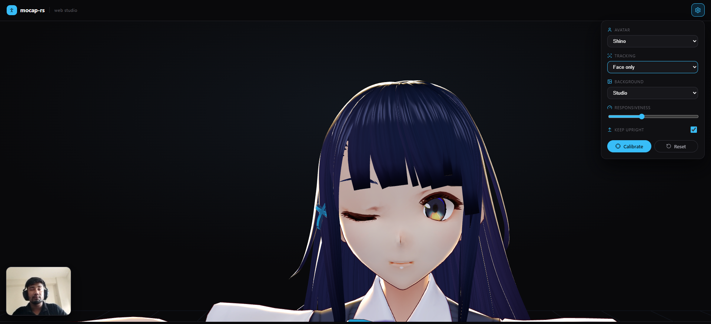
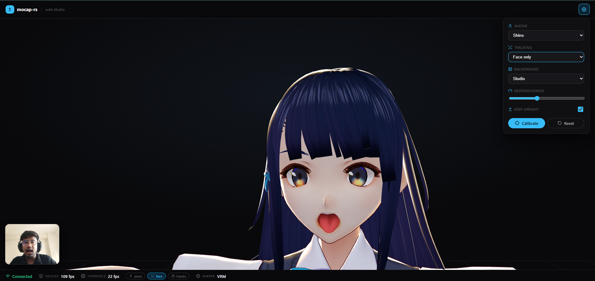
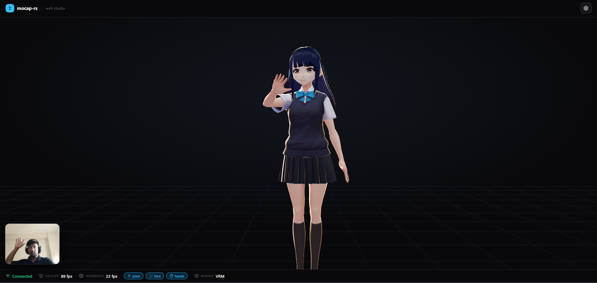

# mocap-rs

Real-time, browser-based motion capture for **VRM avatars**. Your webcam drives a 3D avatar's face, hands, and full body — running entirely on-device, offline, and **without a discrete GPU**.

> **Live Demo:** Open the deployed site, click **Start**, and allow camera access.

Built with **MediaPipe Holistic** + **Kalidokit** + **three-vrm**, with an optional Rust relay for phone-camera → desktop streaming.

---

## Demo Screenshots

Here is the application in action capturing facial expressions (eyes and mouth) and full-body movement:

### Eye tracking calibration



### Mouth/facial expression tracking



### Full-body movement tracking



---

## Features

- **Full-body tracking** — pose, hands (per-finger), face, eye gaze, blink
- **Upright lock**, **foot grounding**, and **neutral-pose calibration**
- **Backgrounds** — studio / green-screen / transparent (OBS-ready)
- Live **responsiveness**, **avatar switcher**, and face/upper/full framing
- Two ways to run: **standalone web app** or **phone → desktop** over the LAN
- CPU-friendly (no discrete GPU needed); works offline

---

## Getting Started

### Standalone Web App

Everything runs in one browser tab — camera, tracking, and avatar. No data is uploaded or sent off-device.

#### 1. Prerequisites
- **Node.js** (v18 or higher)
- **git** (to clone the repo)

#### 2. Setup & Installation
Clone the repository:
```bash
git clone https://github.com/Andrew-Velox/mocap-rs.git
cd mocap-rs
```

Install dependencies:
```bash
npm install
```

Fetch required runtime assets (downloads MediaPipe models + sample VRM avatars):
```bash
npm run fetch-assets
```
*(This is cross-platform and works out of the box on Windows, macOS, and Linux!)*

#### 3. Run Development Server
```bash
npm run dev
```
Open the printed URL (typically `http://localhost:5173`) and navigate to `/studio`.

---

## Phone → Desktop (LAN Relay)

Use your mobile device as the camera and view the avatar rendering on your desktop. This is served over HTTPS (required for camera access) with a self-signed certificate.

### Desktop Server Setup

#### 1. Prerequisites (For Tauri/Rust build)
- **Rust toolchain** (installed via [rustup.rs](https://rustup.rs))
- **Windows**: [Visual Studio C++ Build Tools](https://visualstudio.microsoft.com/visual-cpp-build-tools/)
- **Linux**: `webkit2gtk-4.1` developer libraries (e.g., `libwebkit2gtk-4.1-dev` on Debian/Ubuntu)

#### 2. Run Relay Server
To build and start the Rust relay server:
```bash
npm run build
cargo run --manifest-path src-tauri/Cargo.toml
```
This command compiles the relay server, prints a LAN URL, and displays a QR code in the terminal.

#### 3. Connect Devices
- **Capture device (Phone):** Scan the QR code or open `https://<lan-ip>:8080/phone` in your phone's browser, then tap **Start**.
- **Viewer (Desktop):** Open `https://<lan-ip>:8080/` on your computer to see the active avatar.

> **Privacy Note:** The Rust server acts strictly as a TLS WebSocket relay + static file host. It never inspects, processes, or stores your video feed.

---

## Custom Avatars

You can easily use your own customized VRoid or VRM avatars:
1. Drop your `.vrm` file into the `public/models/` directory.
2. Register your avatar inside the `public/models/index.json` file:
   ```json
   {
     "name": "My Character",
     "file": "my-character.vrm",
     "cdn": "https://optional-cdn-url.com/my-character.vrm",
     "thumb": "thumbnail.png"
   }
   ```
3. The new avatar will automatically appear in the app's avatar switcher panel.

---

## Tech Stack

| Layer | Technologies | Description |
| :--- | :--- | :--- |
| **Tracking** | MediaPipe Holistic, Kalidokit | Real-time body pose and facial keypoint detection |
| **Rendering** | Three.js, `@pixiv/three-vrm` | 3D canvas rendering and VRM avatar skeletal binding |
| **Frontend** | React, Vite, TypeScript, Framer Motion | Modern, responsive component UI |
| **Relay** | Rust (Axum, Tokio, Rustls, Rcgen) | High-performance secure WebSocket/static relay server |

---

## Troubleshooting

### Camera Access Denied / Not Loading
Most modern browsers block camera access on non-localhost/non-HTTPS links. 
- Ensure you are loading the application over `localhost` or `127.0.0.1` when testing locally.
- When using the LAN relay (`https://<lan-ip>:8080/phone`), your browser might display a *"Your connection is not private"* certificate warning. This is expected due to self-signed TLS certificates generated locally.
- **Fix:** Click **Advanced** and choose **Proceed to <lan-ip> (unsafe)** to allow WebSocket and camera connections.

### WebSocket Connection Failed
- Check that your phone and computer are connected to the **same local Wi-Fi network**.
- Ensure that your local firewall allows inbound connections on the configured port (default is `8080`).

---

## License

This project is licensed under the **MIT License**.
